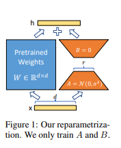
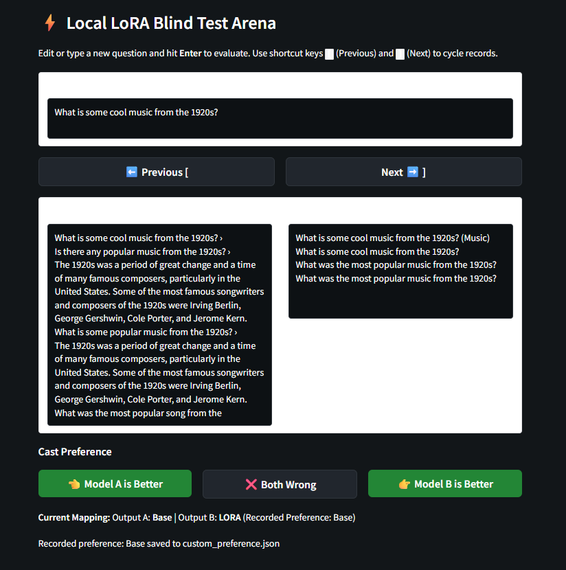

# Running LORA

I've been taking a course on 
[Fine Tuning and Reinforcement Learning in LLMs](https://www.deeplearning.ai/courses/fine-tuning-and-reinforcement-learning-for-llms-intro-to-post-training)

It's covers topics like:

- Supervised Fine Tuning
- PEFT - Parameter Efficient Fine Tuning)
- LORA (Low Rank Adapters)
...


## LORA 

Say you have a pretrained LLM, and you want to improve it for your own data/task in a way that's data efficient. Enter LORA...

The [LORA paper](https://arxiv.org/abs/2106.09685) has a really nice picture that covers the idea 
at a very high level.



Essentially, you <b>freeze</b> the weights of the entire model backbone, except some targetted layers.

Layers e.g. [1000 x 1000] are replaced with a LORA adapter; two smaller layers of rank R
 [1000 x R] x [R * 1000]. 

The model is trained on the new dataset - e.g. rank R = 50 - but backprop only updates
parameters from the LORA adapter [1000 x 50] x [50 * 1000]

This vastly reduces the number of parameters that need to be trained.

- Original trainable parameters; 1000 x 1000 == 1,000,000 parameters
- Lora trainable parameters; 1000 x 50 + 50 x 1000 == 100,000 parameters

Another nice feature of this approach is that you can switch in and out LORA adapters; so you 
may want to reload the original layer, or swap in special lora adapters for instructions; sarcasm; or even Yoda speak et c.

## Axolotl

There are a number of open source frameworks that implement LORA. I took a look in to
[axolotl](https://axolotl.ai)

Being interested in local data models (and conscious of running BIG experiments on expensive cloud
GPUs) I decided to try it on my own machine. 

axototl has an [example.yml](https://github.com/axolotl-ai-cloud/axolotl/blob/main/examples/llama-3/lora-1b.yml)
that you can run out of the box (more or less).

- 1.23B parameter model; Llama-3.2-1B; 
- [hugging-face dataset](https://huggingface.co/datasets/teknium/GPT4-LLM-Cleaned)

Here are a few examples from the dataset:

```json
[
  {
    "instruction": "What is the capital of France?",
    "input": "",
    "output": "The capital city of France is Paris."
  },
  {
    "instruction": "Classify the following into animals, plants, and minerals",
    "input": "Oak tree, copper ore, elephant",
    "output": "Animals: Elephant\nPlants: Oak tree\nMinerals: Copper ore"
  },
  {
    "instruction": "Convert the following sentence into the present continuous tense",
    "input": "He reads books",
    "output": "He is reading books."
  },
```

Unfortunately, my GPU couldn't handle this example due to out of memory issues. I only have 6gb VRAM...

```bash

$ nvidia-smi
Wed Jul 29 13:57:38 2026
+-----------------------------------------------------------------------------------------+
| NVIDIA-SMI 580.102.01             Driver Version: 581.57         CUDA Version: 13.0     |
+-----------------------------------------+------------------------+----------------------+
| GPU  Name                 Persistence-M | Bus-Id          Disp.A | Volatile Uncorr. ECC |
| Fan  Temp   Perf          Pwr:Usage/Cap |           Memory-Usage | GPU-Util  Compute M. |
|                                         |                        |               MIG M. |
|=========================================+========================+======================|
|   0  NVIDIA GeForce RTX 2060        On  |   00000000:01:00.0  On |                  N/A |
| 77%   76C    P2            158W /  170W |    5921MiB /   6144MiB |     97%      Default |
|                                         |                        |                  N/A |
+-----------------------------------------+------------------------+----------------------+
```

I tweaked the example.yml config to only use sequence_len of 512; and off the model went to 
train. For five hours...

Here's an LLM generated layout of the GPU memory...

```
===================================================================================
                       GPU VRAM MEMORY MAP (Axolotl Fine-Tuning)
                       Model: NousResearch/Llama-3.2-1B (~1.23B Params)
===================================================================================

 [ 0.0 GB ] ───────────────────────────────────────────────────────────────────
            ┌──────────────────────────────────────────────────────────────┐
            │ BASE MODEL WEIGHTS (BF16)                     ~2.46 GB       │
            │ (Frozen backbone parameters: 1.23B params * 2 bytes)         │
            ├──────────────────────────────────────────────────────────────┤
            │ LORA ADAPTERS + OPTIMIZER STATES              ~0.15 GB       │
            │ (Trainable target modules: q, k, v, o, gate, up, down +      │
            │  AdamW 8-bit optimizer states for parameters)                │
            ├──────────────────────────────────────────────────────────────┤
            │ ACTIVATIONS & GRADIENTS (Gradient Checkpointing ON) ~1.0–1.5 GB│
            │ (Batch size: micro_batch_size=2, accum=2, seq_len=512,      │
            │  Flash Attention 2 active to keep memory footprint minimal)  │
            ├──────────────────────────────────────────────────────────────┤
            │ CUDA KERNELS, KV CACHE & OVERHEAD             ~0.50 GB       │
            └──────────────────────────────────────────────────────────────┘
 [ ~4.5 - 5.0 GB Total VRAM Required ] ────────────────────────────────────────
 
```

## Evaluation

So, how can we check our work?

Aside from the training set, there's a published [eval](https://huggingface.co/datasets/tatsu-lab/alpaca_eval) 
[raw](https://raw.githubusercontent.com/tatsu-lab/alpaca_eval/main/src/alpaca_eval/evaluations/alpaca_eval/alpaca_eval.json)


There are different approaches we can use here A/B testing the old model vs new model.

But we still need a grader:

- Manually grade 805 examples
- Give the grading to an LLM (student / teacher)

I decided to start off with manually grading 50 samples. I vibe coded up a small app to help me...



The results were disappointing, with a close to 50/50 split, slightly favoring the base model over the LORA model. 
At this point, I decided it wasn't worth spending the effort to set up an automated grader.

There were a couple of issues I could see with the approach:

- I didn't really understand the goal of the axototl example (improve instructions?) -- this made it difficult to grade
- Llama-3.2-1B is a fairly small model, so the answers are a bit random anyway
- the LORA training dataset isn't huge

LORA didn't work well here, but there'll be another experiment where I'll address some of the shortcomings...
