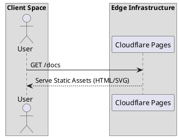

# System Diagram

```puml
@startuml
skinparam backgroundcolor transparent
skinparam boxpadding 10

box "Client Space"
actor User
end box

box "Edge Infrastructure"
participant "Cloudflare Pages" as CF
end box

User -> CF : GET /docs
CF --> User : Serve Static Assets (HTML/SVG)
@enduml
```
